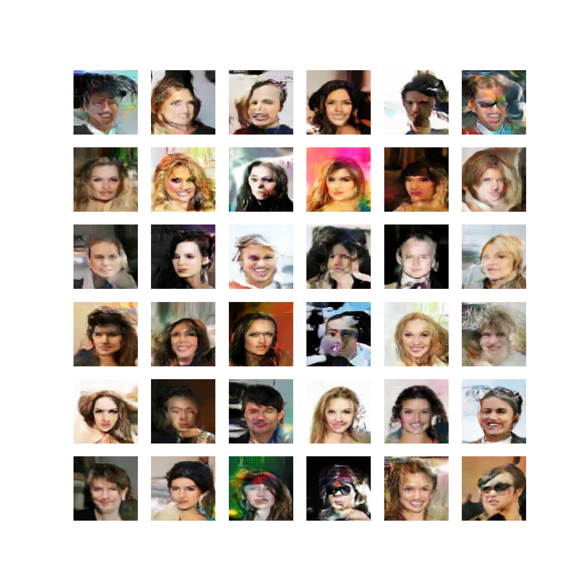

# Face Generation using DCGAN

Caption: Generated faces after training the DCGAN for 20 epochs.

...

This repository contains an implementation of a Deep Convolutional Generative Adversarial Network (DCGAN) for face generation. The code is provided as a Jupyter notebook, allowing you to easily run and experiment with the DCGAN model. Due to computational constraints, the notebook is set to run for only 20 epochs, but you can modify and run it for more epochs as desired (suggested: 1000).

## DCGAN Overview

DCGAN is a class of generative models that combines a deep convolutional neural network (CNN) with a generative adversarial network (GAN) architecture. It was introduced by Radford et al. in their paper, "Unsupervised Representation Learning with Deep Convolutional Generative Adversarial Networks". DCGANs have been particularly successful in generating realistic images, including human faces.

In short, a DCGAN consists of two main components: the generator and the discriminator.

1. **Generator**: The generator takes a random noise vector as input and generates an image. It learns to transform the input noise into images that resemble the training data. The generator's objective is to create realistic images that can deceive the discriminator.

2. **Discriminator**: The discriminator is a binary classifier that learns to distinguish between real images from the training dataset and fake images generated by the generator. Its objective is to correctly classify images as real or fake. The discriminator provides feedback to the generator, helping it improve its generated images.

During training, the generator and discriminator are trained simultaneously in an adversarial manner. The generator aims to generate images that are realistic enough to fool the discriminator, while the discriminator learns to become better at distinguishing between real and fake images. This competition between the generator and discriminator leads to the improvement of both models over time.

Follow the instructions provided in the notebook to run and experiment with the DCGAN model. Modify the number of epochs as desired to train the model for a different number of iterations.

This iterative training process helps the generator to improve its ability to generate high-quality images that closely resemble real human faces.

## Running the Code

To run the face generation code, follow these steps:

1. Open the provided Jupyter notebook, [DCGAN_Face_Generation.ipynb](https://colab.research.google.com/drive/1QDBcsXtzl18ay3tZDgUh3wLN7xqtt6uC?usp=sharing), in Google Colab.

2. Make sure you have a compatible GPU runtime enabled in Google Colab to speed up the training process.

3. Execute the notebook cells sequentially to load the required libraries, define the DCGAN architecture, and train the model for the desired number of epochs.

4. You can adjust the hyperparameters, such as the learning rate, number of epochs, and batch size, according to your requirements.

5. After training, the notebook will generate synthetic human faces based on the trained DCGAN model. You can visualize the generated faces and experiment with different hyperparameters to observe the changes in the generated images.

## Note

- While the provided notebook runs for a limited number of epochs, it is recommended to train the DCGAN for a higher number of epochs (e.g., 1000) to achieve more realistic face generation.

- Due to computational constraints, running the notebook for a large number of epochs may require significant computational resources. It is advisable to utilize powerful GPUs or cloud-based GPU instances to expedite the training process.

- The DCGAN implementation in the notebook serves as a starting point for face generation. For more advanced results, you can explore additional techniques such as progressive growing, spectral normalization, or incorporating more complex architectures like StyleGAN or BigGAN.

## Acknowledgements

- The DCGAN implementation in this repository is inspired by the original paper ["Unsupervised Representation Learning with Deep Convolutional Generative Adversarial Networks"](https://arxiv.org/abs/1511.06434) by Radford et al.

- We acknowledge the developers and contributors of Python, TensorFlow, and other open-source libraries utilized in this project for their valuable contributions to the deep learning and machine learning communities.

- Special thanks to Google Colab for providing a free cloud-based Jupyter notebook environment with GPU support.

## License

This project is licensed under the [MIT License](LICENSE).
